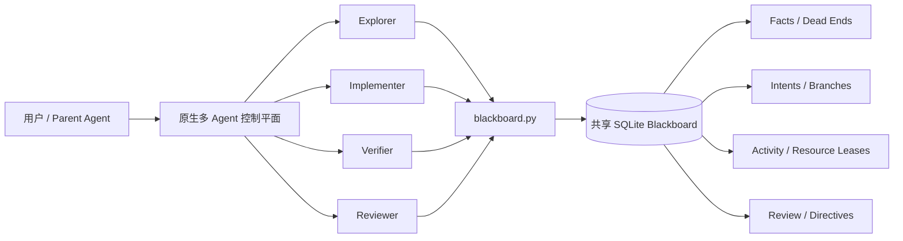

# Multi-agentcollaboration-blackboard

一个面向多 Agent / Subagent 协作的持久化黑板 Skill 与无依赖 CLI。

它使用共享 SQLite 数据库保存可复用事实、失败路径、工作意图、审查状态和
租约，让多个 Agent 不再只依赖容易丢失的聊天上下文，而是围绕一份可审计、
可并发访问的共享状态协作。

> 项目定位：**原生多 Agent 工具负责调度，Blackboard 负责持久状态与并发控制。**


## 为什么需要协作黑板

并行启动多个 Agent 并不等于有效协作。缺少共享状态时，常见问题包括：

- 多个 Agent 重复扫描、构建或分析同一目标；
- 某个 Agent 已经排除的方向被其他 Agent 反复尝试；
- 候选结论被误当成已验证事实；
- 过期 Worker 覆盖新 Worker 的结果或释放其资源；
- 关键发现只存在于临时消息中，Agent 退出后无法复用；
- 独占账号、监听端口、Shell 或环境被并发使用而发生冲突。

本项目通过事实、意图、活动和资源四类共享状态解决这些问题。

## 核心能力

- **持久事实**：区分 candidate、verified、challenged 与 retired 状态。
- **失败路径复用**：记录带作用域和重开条件的 dead end，避免团队循环试错。
- **Intent 所有权**：一个方向只由一个 Worker 在有效租约内负责。
- **Activity 去重**：避免重复执行昂贵但非独占的扫描、构建、下载或反编译。
- **Resource 互斥**：保护账号、目标、监听器、设备、Shell 和共享环境。
- **Review 控制**：支持事实挑战、路线抑制、分支假设和 Operator Directive。
- **原子并发**：使用 SQLite 事务完成 claim、续租、释放和状态写入。
- **安全降级**：Blackboard 不可用时，停止重复尝试并切换到原生协作。
- **兼容迁移**：支持新的 `MULTI_AGENT_COLLABORATION_*` 配置，同时保留
  `INFINITEX_*` 兼容入口。

## 双平面架构



### 原生控制平面负责

- 创建和分配 Agent；
- 发送即时消息、追问和中断；
- 收集子任务最终结果；
- 管理 Parent / Child 生命周期。

### Blackboard 状态平面负责

- 保存跨 Worker 可复用的证据；
- 声明工作方向与租约；
- 抑制重复活动；
- 锁定独占资源；
- 保存 Review、Directive、Branch 和失败路径。

Blackboard 不是聊天室，也不负责创建 Agent。

## 状态模型速览

| 概念 | 用途 | 示例 |
|---|---|---|
| **Fact** | 保存候选或已验证结论 | `测试命令返回 200，响应包含版本 1.4.2` |
| **Dead end** | 保存已充分排除的方向 | `接口参数化；12 组 payload 响应不变；发现新 SQL sink 时重开` |
| **Intent** | 一个 Agent 对一个方向的所有权 | `分析认证流程` |
| **Activity** | 避免重复昂贵工作 | `decompile:client.exe` |
| **Resource** | 对共享对象进行互斥控制 | `account:admin@service` |
| **Directive** | 控制工作优先级或范围 | `优先验证版本差异` |
| **Branch** | 隔离互不兼容的假设 | `配置来自本地文件` / `配置来自远端 API` |

Intent、Activity 与 Resource 可以同时使用：Agent 可以拥有一个 Intent，在其
内部领取一次昂贵 Activity，并在真正产生冲突的操作前短暂锁定 Resource。

## 环境要求

- Python 3.9 或更高版本；
- Python 标准库中的 `sqlite3`；
- 由 Coordinator 或现有系统创建的兼容 Blackboard 数据库。


## 目录结构

```text
multi-agentcollaboration-blackboard/
├── SKILL.md
├── blackboard.py
├── README.md
├── agents/
│   └── openai.yaml
├── docs/
│   └── introduction.md
├── references/
│   ├── collaboration-patterns.md
│   ├── command-reference.md
│   └── state-model.md
└── tests/
    └── test_blackboard.py
```

python -B C:\path\to\skill-creator\scripts\quick_validate.py .
```

## 使用边界

- 一块 DB 只能对应一个 Run；
- CLI 是 Worker 侧接口，不负责创建 Agent；
- CLI 不会自动生成一个猜测的 Coordinator DB；
- SQLite Schema 没有独立 fencing token，因此 Worker ID 不能跨进程复用；
- Blackboard 不替代紧急原生消息，也不应保存无关敏感信息或完整聊天记录。

## 延伸阅读

- [多 Agent 协作模式](references/collaboration-patterns.md)
- [CLI 命令参考](references/command-reference.md)
