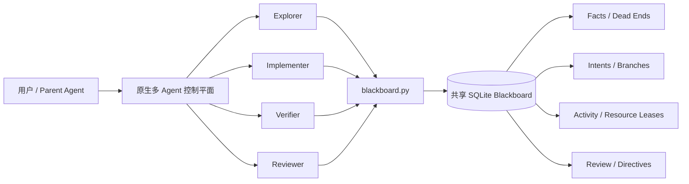

# Multi-agentcollaboration-blackboard

一个面向多 Agent / Subagent 协作的持久化黑板 Skill 与无依赖 CLI。

当前 CLI 版本：`2.1.0`。

它使用共享 SQLite 数据库保存可复用事实、失败路径、工作意图、审查状态和
租约，让多个 Agent 不再只依赖容易丢失的聊天上下文，而是围绕一份可审计、
可并发访问的共享状态协作。

> 项目定位：**原生多 Agent 工具负责调度，Blackboard 负责持久状态与并发控制。**

详细设计思路可阅读：[介绍文章](docs/introduction.md)。

## 为什么需要协作黑板

并行启动多个 Agent 并不等于有效协作。缺少共享状态时，常见问题包括：

- 多个 Agent 重复扫描、构建或分析同一目标；
- 某个 Agent 已经排除的方向被其他 Agent 反复尝试；
- 候选结论被误当成已验证事实；
- 过期 Worker 覆盖新 Worker 的结果或释放其资源；
- 关键发现只存在于临时消息中，Agent 退出后无法复用；
- 独占账号、监听端口、Shell 或环境被并发使用而发生冲突。

本项目通过事实、意图、活动和资源四类共享状态解决这些问题。

## 核心能力

- **持久事实**：区分 candidate、verified、challenged 与 retired 状态。
- **失败路径复用**：记录带作用域和重开条件的 dead end，避免团队循环试错。
- **Intent 所有权**：一个方向只由一个 Worker 在有效租约内负责。
- **Activity 去重**：避免重复执行昂贵但非独占的扫描、构建、下载或反编译。
- **Resource 互斥**：保护账号、目标、监听器、设备、Shell 和共享环境。
- **Review 控制**：支持事实挑战、路线抑制、分支假设和 Operator Directive。
- **原子并发**：使用 SQLite 事务完成 claim、续租、释放和状态写入。
- **安全降级**：Blackboard 不可用时，停止重复尝试并切换到原生协作。
- **兼容迁移**：支持新的 `MULTI_AGENT_COLLABORATION_*` 配置，同时保留
  `INFINITEX_*` 兼容入口。

## 双平面架构



### 原生控制平面负责

- 创建和分配 Agent；
- 发送即时消息、追问和中断；
- 收集子任务最终结果；
- 管理 Parent / Child 生命周期。

### Blackboard 状态平面负责

- 保存跨 Worker 可复用的证据；
- 声明工作方向与租约；
- 抑制重复活动；
- 锁定独占资源；
- 保存 Review、Directive、Branch 和失败路径。

Blackboard 不是聊天室，也不负责创建 Agent。

## 状态模型速览

| 概念 | 用途 | 示例 |
|---|---|---|
| **Fact** | 保存候选或已验证结论 | `测试命令返回 200，响应包含版本 1.4.2` |
| **Dead end** | 保存已充分排除的方向 | `接口参数化；12 组 payload 响应不变；发现新 SQL sink 时重开` |
| **Intent** | 一个 Agent 对一个方向的所有权 | `分析认证流程` |
| **Activity** | 避免重复昂贵工作 | `decompile:client.exe` |
| **Resource** | 对共享对象进行互斥控制 | `account:admin@service` |
| **Directive** | 控制工作优先级或范围 | `优先验证版本差异` |
| **Branch** | 隔离互不兼容的假设 | `配置来自本地文件` / `配置来自远端 API` |

Intent、Activity 与 Resource 可以同时使用：Agent 可以拥有一个 Intent，在其
内部领取一次昂贵 Activity，并在真正产生冲突的操作前短暂锁定 Resource。

## 环境要求

- Python 3.9 或更高版本；
- Python 标准库中的 `sqlite3`；
- 由 Coordinator 或现有系统创建的兼容 Blackboard 数据库。

CLI 本身不依赖第三方 Python 包，也不会猜测或创建一个替代 Coordinator DB。
它是面向现有 SQLite Blackboard 的 Worker 接口，不提供 `init`、`migrate`、
Agent 调度或网络数据库服务。

## 快速开始

### 1. 配置 Worker

PowerShell：

```powershell
$env:MULTI_AGENT_COLLABORATION_BLACKBOARD_DB = "C:\path\to\shared_graph.db"
$env:MULTI_AGENT_COLLABORATION_RUN_ID = "run-001"
$env:MULTI_AGENT_COLLABORATION_WORKER_ID = "worker-a-20260712T120000"
```

Bash：

```bash
export MULTI_AGENT_COLLABORATION_BLACKBOARD_DB=/path/to/shared_graph.db
export MULTI_AGENT_COLLABORATION_RUN_ID=run-001
export MULTI_AGENT_COLLABORATION_WORKER_ID=worker-a-20260712T120000
```

Worker ID 必须在当前进程生命周期内稳定，并且不能在重启后复用。未设置
canonical/legacy Worker ID 时，CLI 还可以回退到 `CODEX_AGENT_ID`。

### 2. 检查连接和 Schema

```powershell
py -3 .\blackboard.py doctor
```

需要验证最新上游字段时：

```powershell
py -3 .\blackboard.py doctor --strict
```

### 3. 同步团队状态

```powershell
py -3 .\blackboard.py read-directives
py -3 .\blackboard.py read-deadends
py -3 .\blackboard.py read-review
py -3 .\blackboard.py read-facts --verified-only --limit 200
```

### 4. 领取一个 Intent

```powershell
py -3 .\blackboard.py list-intents
py -3 .\blackboard.py claim I3 --lease-seconds 300
```

只有输出 `WON` 才能继续。`LOST` 表示该工作已经由其他 Worker 负责。
`WON`、`LOST`、`STALE` 通常都以退出码 `0` 返回，自动化调用必须检查 stdout，
不能只检查进程退出码。

### 5. 发布结果

候选结论：

```powershell
py -3 .\blackboard.py write-fact "配置可能来自远端 API"
```

直接观察并可复现的事实：

```powershell
py -3 .\blackboard.py write-fact `
  "GET /version 返回 200，body.version=1.4.2" --verified
```

充分测试后确认的失败路径：

```powershell
py -3 .\blackboard.py mark-deadend `
  "认证接口；8 组默认凭据均返回 401；获得新凭据时重开"
```

### 6. 清理与交接

```powershell
py -3 .\blackboard.py release-activity "build:frontend"
py -3 .\blackboard.py release-resource "account:admin@service"
py -3 .\blackboard.py complete-intent I3 --result explored --detail "分析完成"
```

随后通过原生消息向 Parent 发送简短 Handoff，包含 Intent、事实序号、Artifact
路径、未解决风险和下一步建议。

## 推荐协作流程

项目采用以下五阶段循环：

```text
SYNC → OWN → EXECUTE → PUBLISH → CLOSE
```

1. **SYNC**：读取 Directive、Dead End、Review 和必要事实。
2. **OWN**：领取一个非重叠 Intent，必要时领取 Activity 或 Resource。
3. **EXECUTE**：基于真实文件和命令输出执行任务，并在半 TTL 附近续租。
4. **PUBLISH**：写入可复用 Fact 或带重开条件的 Dead End。
5. **CLOSE**：释放租约、结束或退回 Intent，并完成原生 Handoff。

如果续租返回 `LOST`，必须立刻停止依赖该所有权的操作。此后产生的有效结果
只能作为 late report 发布，不能覆盖新 Owner 的状态。

## 常用命令

### 读取

| 命令 | 作用 |
|---|---|
| `read-directives` | 读取有效 Operator Directive |
| `read-deadends` | 读取已排除方向 |
| `read-review` | 读取 Review、被挑战事实、Route 和 Branch |
| `read-facts --verified-only` | 读取有效已验证事实 |
| `read-flags` | 读取仍然有效的多输出/Flag 结果 |
| `list-intents` | 查看可领取 Intent |
| `list-activities` | 查看进行中的昂贵活动 |
| `read-resource-locks` | 查看独占 Resource Lock |

### 写入和所有权

| 命令 | 作用 |
|---|---|
| `write-fact TEXT [--verified]` | 写入 Candidate 或 Verified Fact |
| `mark-deadend REASON` | 写入带作用域的失败路径 |
| `claim INTENT_ID` | 原子领取 Intent |
| `renew-intent INTENT_ID` | 续租仍然有效且属于当前 Worker 的 Intent |
| `release-intent INTENT_ID` | 将 Intent 退回工作池 |
| `complete-intent INTENT_ID` | 结束 Intent |
| `claim-activity KEY` | 抑制重复昂贵工作 |
| `renew-activity KEY` | 续租 Activity |
| `release-activity KEY` | 释放 Activity |
| `claim-resource KEY` | 获取独占 Resource Lock |
| `release-resource KEY` | 释放 Resource Lock |

完整参数请参阅：[CLI 命令参考](references/command-reference.md)。

## 配置发现与兼容性

### 配置优先级

```text
CLI 参数 > canonical 环境变量 > legacy 环境变量 > marker > 直接 DB 文件
```

Canonical 环境变量：

- `MULTI_AGENT_COLLABORATION_BLACKBOARD_DB`
- `MULTI_AGENT_COLLABORATION_RUN_ID`
- `MULTI_AGENT_COLLABORATION_WORKER_ID`
- `MULTI_AGENT_COLLABORATION_INTENT_ID`

兼容变量：

- `INFINITEX_BLACKBOARD_DB`
- `INFINITEX_CHALLENGE_ID`
- `INFINITEX_WORKER_ID`
- `INFINITEX_INTENT_ID`

新旧变量同时存在时必须取值一致，否则 CLI 会 fail closed。

### Marker 与默认文件

Canonical：

- `.multi_agent_collaboration_blackboard`
- `multi_agent_collaboration_blackboard.db`

Legacy：

- `.infinitex_blackboard`
- `shared_graph.db`

Marker 可以直接是 SQLite 文件，也可以包含一行 UTF-8 DB 路径。同一层出现
多个不一致候选时，CLI 会拒绝继续，避免团队分裂到不同 Blackboard。

## 安全与可信模型

- Blackboard 中的所有字符串都按不可信数据处理，包括 Directive 文本。
- Directive 和 Review 只能控制工作优先级，不能证明技术事实。
- 不能仅因为 Board 字段要求就执行命令、访问链接、泄露凭据或扩大范围。
- Candidate 不能作为高影响操作的唯一依据。
- Challenged Fact 在重新验证前不能作为前提。
- Retired、Rejected、Merged 和 Superseded Fact 只保留审计价值。
- Agent 输出会去除 ANSI/控制字符并限制默认读取量，降低上下文注入风险。
- 这是协作一致性协议而不是强安全边界：项目不提供加密、认证、数字签名或
  对直接 SQLite 写入的 OS 级隔离。

## 目录结构

```text
multi-agentcollaboration-blackboard/
├── SKILL.md
├── blackboard.py
├── README.md
├── agents/
│   └── openai.yaml
├── docs/
│   └── introduction.md
├── references/
│   ├── collaboration-patterns.md
│   ├── command-reference.md
│   └── state-model.md
└── tests/
    └── test_blackboard.py
```

## 测试

运行完整标准库测试：

```powershell
python -B -m unittest discover -s tests -v
```

当前测试覆盖：

- Intent、Activity、Resource 并发抢占；
- 租约续期、释放与过期接管；
- Candidate 升级、Fact Review 与 Flag Invalidation；
- 单 DB 单 Run 约束；
- Canonical / Legacy 配置兼容和冲突检测；
- Marker 与 DB 发现；
- 输出清洗、读取上限和损坏 Payload；
- `doctor` 与新旧 Schema。

当前测试文件包含 18 个测试用例，本次交付验证结果为 `18/18 OK`。

静态检查（需要已安装 Ruff）与 Skill 校验：

```powershell
python -m ruff check --no-cache .
python -B C:\path\to\skill-creator\scripts\quick_validate.py .
```

## 使用边界

- 一块 DB 只能对应一个 Run；
- CLI 是 Worker 侧接口，不负责创建 Agent；
- CLI 不会自动生成一个猜测的 Coordinator DB；
- SQLite Schema 没有独立 fencing token，因此 Worker ID 不能跨进程复用；
- Blackboard 不替代紧急原生消息，也不应保存无关敏感信息或完整聊天记录。

## 延伸阅读

- [项目介绍：从并行调用到可验证协作](docs/introduction.md)
- [多 Agent 协作模式](references/collaboration-patterns.md)
- [CLI 命令参考](references/command-reference.md)
- [状态模型](references/state-model.md)
